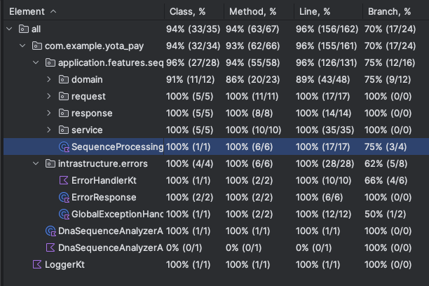

To run tests, use the following command:

```bash
./gradlew test
```

## Tests

Coverage: 

## API Usage Examples

### Validate DNA Sequence

```bash
# Valid sequence
curl -X POST http://localhost:8080/api/sequence/validate \
  -H "Content-Type: application/json" \
  -d '{"sequence": "ATCG"}'
```

```bash
# Invalid sequence (contains invalid characters)
curl -X POST http://localhost:8080/api/sequence/validate \
  -H "Content-Type: application/json" \
  -d '{"sequence": "ATCGX"}'
```

### Calculate GC Content

```bash 
# Valid sequence
curl -X POST http://localhost:8080/api/sequence/gc-content \
  -H "Content-Type: application/json" \
  -d '{"sequence": "ATCGGC"}'
```

```bash 
# Error case (empty sequence)
curl -X POST http://localhost:8080/api/sequence/gc-content \
  -H "Content-Type: application/json" \
  -d '{"sequence": ""}'
```

### Find Motif

```bash
# Valid sequence and motif
curl -X POST http://localhost:8080/api/sequence/find-motif \
  -H "Content-Type: application/json" \
  -d '{"sequence": "ATCGATCG", "motif": "ATC"}'
```

```bash
# Valid sequence but motif not found
curl -X POST http://localhost:8080/api/sequence/find-motif \
  -H "Content-Type: application/json" \
  -d '{"sequence": "ATCGATCG", "motif": "GGG"}'
```

### Transform DNA to RNA

```bash
# Valid sequence
curl -X POST http://localhost:8080/api/sequence/transform \
  -H "Content-Type: application/json" \
  -d '{"sequence": "ATCG"}'
```

```bash
# Error case (invalid characters)
curl -X POST http://localhost:8080/api/sequence/transform \
  -H "Content-Type: application/json" \
  -d '{"sequence": "ATCGX"}'
```

### Reverse Complement

```bash
# Valid sequence
curl -X POST http://localhost:8080/api/sequence/reverse-complement \
  -H "Content-Type: application/json" \
  -d '{"sequence": "ATCG"}'
```

```bash
# Error case (empty sequence)
curl -X POST http://localhost:8080/api/sequence/reverse-complement \
  -H "Content-Type: application/json" \
  -d '{"sequence": ""}'
```

Note: All endpoints return JSON responses. Error responses will include an error message and status code.

## AI cooperation use cases:

### Planning the feature

The idea is to gather the information about the problem and throw it into the chat window
to brainstorm it resulting in a detailed tech plan with business logic implementation,
tests, nice to have features.

This allows you to have a look at the problem at another view as well as expanding your
solution with additional ideas or criticize your proposed solution pointing at
weak spots.

Doesn't require you to do it in a terminal session with Aider.

### Planning the technical implementation

To start planning the technical implementation after reviewing the idea you could
simply copy the LLM output from the chat window, navigate to the terminal with
Aider session and use `/paste`.

### Approach coding

At this point you will have a detailed technical plan with steps.
You can start generating the code by doing something like this:

> `/code let's start from step 1 following our plan`

The idea is to have an iterative process introducing changes in small portions
to preserve the context.

### Fixing Tests Loop

1. Run tests, see failures.
2. Use `/ask` to provide context about what has happened.
3. Receive an assumption.
4. Use a plain command to perform the action.

---

#### Step 1:

**Input:**

>
`/ask this line: service.validateSequence("").shouldBeFalse() produces: io.kotest.assertions.AssertionFailedError: expected:<false> but was:<true>`

**Output:**

Ah, I see the issue! The test expects an empty string to be invalid, but the current implementation in
`SequenceValidationService` returns `true` for empty strings. This is because the `all()` function returns `true` for
empty collections/sequences by default.

Let's fix the `SequenceValidationService` to explicitly handle empty strings:

`src/main/kotlin/com/example/yota_pay/application/features/sequence_processing/service/SequenceValidationService.kt`

```kotlin
package com.example.yota_pay.application.features.sequence_processing.service

import org.springframework.stereotype.Service

@Service
class SequenceValidationService {
    fun validateSequence(sequence: String): Boolean {
        if (sequence.isEmpty()) return false
        val validCharacters = setOf('A', 'T', 'C', 'G')
        return sequence.all { it in validCharacters }
    }
}
```

#### Step 2:

Input:

> make these changes

**Output:**

The changes ensure empty strings are properly handled as invalid DNA sequences while maintaining the existing validation
logic for non-empty strings.

Here’s the updated file with the changes applied:

`src/main/kotlin/com/example/yota_pay/application/features/sequence_processing/service/SequenceValidationService.kt`

```kotlin

package com.example.yota_pay.application.features.sequence_processing.service

import org.springframework.stereotype.Service

@Service
class SequenceValidationService {
    fun validateSequence(sequence: String): Boolean {
        +if (sequence.isEmpty()) return false
        val validCharacters = setOf('A', 'T', 'C', 'G')
        return sequence.all { it in validCharacters }
    }
}
```

Tokens: 3.5k sent, 135 received.

Applied edit to:
`src/main/kotlin/com/example/yota_pay/application/features/sequence_processing/service/SequenceValidationService.kt`

Commit: 7381ebd fix: handle empty strings as invalid DNA sequences in SequenceValidationService

### Refactoring

Playing around with different tools and models generate a slightly different
code styles in tests, so we can try to ask it to unify the style of tests.

**Output**:

Current inconsistencies across test files:

1. Request Specification Setup:

* Some use RestAssured.port = port
* Others use RequestSpecBuilder() with full configuration

2. Test Structure:

* Some use contentType("application/json") inline
* Others configure it in request spec
* Some use statusCode() with HttpStatus enum
* Others use raw status codes

3. Assertion Style:

* Mix of Kotest matchers and RestAssured matchers
* Some use shouldBeEqual while others use shouldBe

Proposed unified style:

1. Request Specification:

* Use RequestSpecBuilder() consistently
* Configure base URI, port and content type once in beforeSpec

2. Test Structure:

* Use HttpStatus enum for status codes
* Keep consistent Given/When/Then structure
* Use Kotest matchers for assertions

3. Assertion Style:

* Prefer Kotest matchers (shouldBe) over RestAssured matchers
* Use plusOrMinus for double comparisons
* Use collection matchers like shouldContainExactly

4. Formatting:

* Consistent spacing between test blocks
* Consistent indentation
* Consistent line breaks for long method chains

Let's apply these changes file by file. Which file would you like to start with?

The changes will be purely stylistic - we won't modify any test logic or assertions, just make them consistent in style
and structure.
